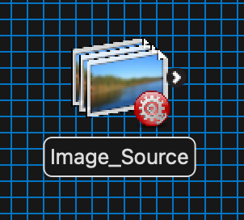
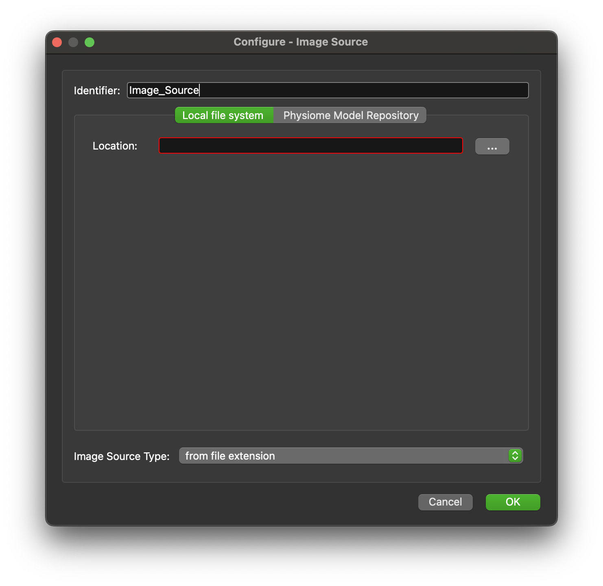

Image Source
==============

Overview
--------

The **Image Source** is MAP Client plugin for providing an interface to getting a listing of image files available in a directory.

Workflow Connections
--------------------

As shown in :numref:`fig-mcp-image-source-workflow-connections`, the **Image Source** produces one output which may be piped to another workflow step:

.. _fig-mcp-image-source-workflow-connections:

   **Image Source** workflow connections.

Information on this plugins' specification is available :ref:`here <mcp-image-source-specification>`.

Configuration
-------------

This step is used for getting a list of images in numerical order from a directory.
Use the directory chooser to select a directory from which to choose images.

.. _fig-mcp-image-source-configure-dialog:

   **Image Source** step configuration dialog.

Instructions
------------

This is a non-interactive step.
See `Configuration`_.

.. toctree::
  :hidden:
  :caption: Image Source
  :maxdepth: 1

  specification.rst
